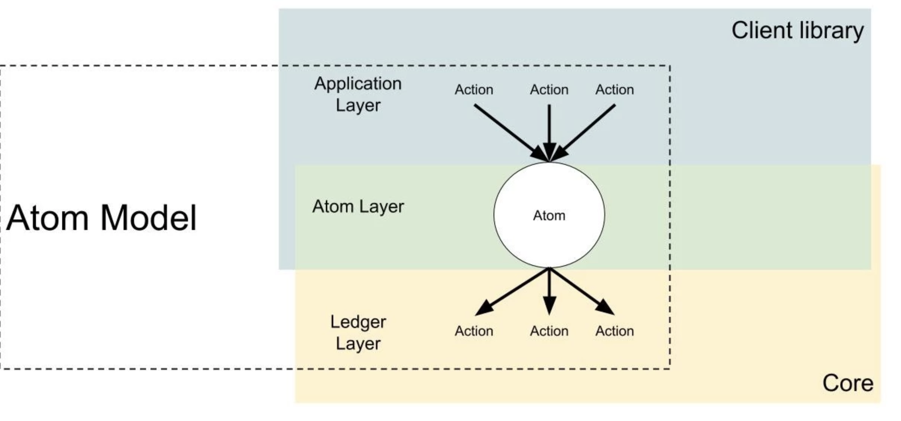

# Alpha

## Introduction

The current Radix Alpha Network helps you to

* store wealth, 
* facilitate monetary transactions or transfer value, and
* record immutable data like messages, hashes or meta-data.  

Each node in the Radix network exposes a [JSON-RPC](https://www.radixdlt.com/post/json-rpc-vs-rest) interface to interact with the application layer using client libraries. Radix has open sourced these client libraries to easily build decentralized applications in your preferred choice of programming language starting with Java, Kotlin & JavaScript.

## Technical Architecture

### Abstractions by Layer

### Codebases by Layer

### Atom Model

If this is your first time building decentralized applications on the Radix Alpha Network you can get started with the:

* [Java Client Library](java-client-library-guide/)
* [Kotlin Client Library](kotlin-client-library-guide/)
* [JavaScript Client Library](javascript-client-library-guide/quick-start.md) 

